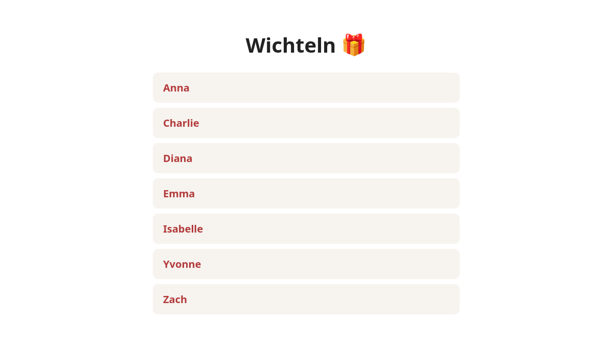

# erstelle_wichtelliste

Ihr seid eine Familie oder ein Freundeskreis, der sich untereinander beschenken will, möchtet aber das klassische Losziehen vereinfachen? Oder ihr seid nicht am gleichen Ort und möchtet eure Tradition trotzdem weiterführen?

Dieses python-Script erstellt anhand der Namen in **personen.txt** eine zufällige Paarung mit Wichtel und beschenkter Person und gibt diese anschliessend per HTML aus, für jeden Wichtel eine eigene Seite.

Damit die zu beschendenke (und zu überraschende Person) nicht aus Versehen angezeigt wird, ist sie erst nach einem Klick sichtbar.

Die Seiten sind nicht geschützt, es funktioniert auf Vertrauensbasis der Teilnehmer. Somit könnte ein Teilnehmer sich seine Überraschung verderben und bei den a

# Voraussetzungen
1. Python 3.12 (oder ähnlich) vorhanden auf deinem System
1. Ein Webserver für statische HTML-Dateien, um das Resultat der Losziehung mit den Teilnehmern zu teilen.

# Anleitung

1. Du hast Python 3.12 oder ähnlich auf deinem System installiert.
1. Klone das Repo.
1. Fülle die Datei **personen.txt** mit den gewünschten Teilnehmernamen aus und speichere sie.
1. Führe `python wichtellist.py` aus.

Im Ordner `output` wurde nun für jeden Teilnehmer eine html-Datei erstellt plus eine Datei **index.html**

Lade die Dateien auf deinen Webserver hoch und verschicke die Links dazu.

# Screenhots

Index, für alle Teilnehmer:

Seite für Emma, zugeklappt:

Seite für Emma, aufgeklickt:
